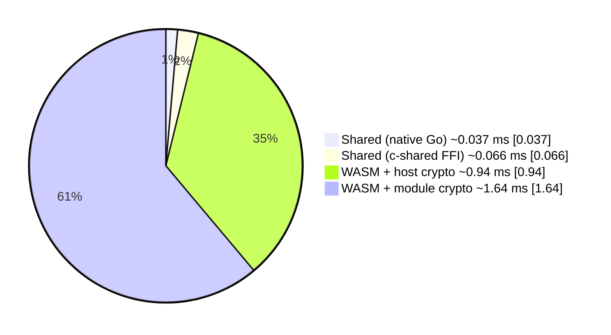
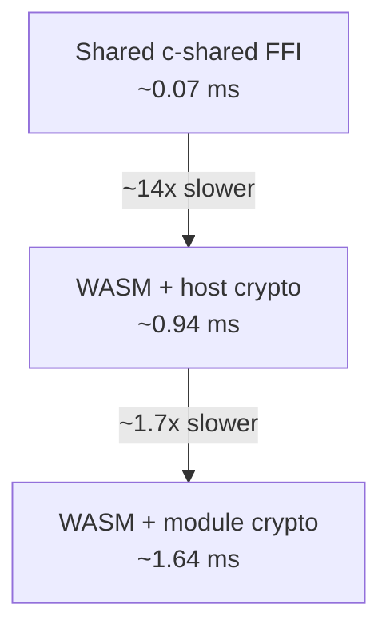

# WASM Crypto Provider POC

This proof‑of‑concept demonstrates how the experimental TDF writer can be compiled to WASM and delegate all cryptographic operations to a host environment.

## Layout

```
examples/wasm/tdf_poc/
├── module/    # Go code compiled to WASM (can use host crypto or in-module Go crypto)
├── host/      # Native Go host using Wasmtime to satisfy hostcrypto imports and drive benchmarks
├── cshared/   # -buildmode=c-shared wrapper + libtdf.so artifacts and FFI samples
└── README.md  # This file
```

The module exports the TDF writer entry points (`TDFNewWriter`, `TDFWriteSegment`, `TDFFinalize`, etc.) plus helpers to switch between two crypto implementations:

- **host** (default): cryptographic operations proxy back to the embedder through the `hostcrypto.*` imports.
- **module**: cryptographic operations run inside the WASM module using the same Go helpers that the native build relies on.

## Building the WASM module

The module must be compiled with the WASI target:

```bash
GOOS=wasip1 GOARCH=wasm go build -o writer.wasm ./examples/wasm/tdf_poc/module
```

## Running with the provided host

The host example uses [wasmtime-go](https://github.com/bytecodealliance/wasmtime-go) to instantiate the module and implements the required `hostcrypto.*` functions in Go.

```bash
# Install the wasmtime-go dependency once (outside the sandbox if necessary)
go get github.com/bytecodealliance/wasmtime-go/v38

# Build the host runner (linker defines WASI and hostcrypto imports)
go build -o host-runner ./examples/wasm/tdf_poc/host

# Execute using host-provided crypto (default)
./host-runner -wasm writer.wasm -mode host

# Benchmark both host and module crypto implementations
./host-runner -wasm writer.wasm -mode both -iterations 5
```

When multiple modes or iterations are requested, the runner reports per-iteration durations and, if `-out` is specified, writes distinct output files using the pattern `<basename>_<mode>_<iteration>.zip`.

### Benchmarking

Use Go’s benchmarking harness to capture stable host vs. module timings:

```bash
go test -bench=BenchmarkCrypto -run=^$ ./examples/wasm/tdf_poc/host
```

The benchmarks compile the WASM module automatically, disable module-side logging, and report allocations so you can compare host-proxied and in-module cryptography.

If any of the host bridge functions are missing or implemented incorrectly, the module will return a non-zero status and the logs will include the failure.

## Native shared library (-buildmode=c-shared)

`examples/wasm/tdf_poc/cshared` repackages the same Go writer behind a C-friendly API so Python, Node, or any FFI consumer can call it without the WASM runtime. Building the shared object also emits a header with the exported symbols:

```bash
GOOS=$(go env GOOS) GOARCH=$(go env GOARCH) \
  go build -buildmode=c-shared -o examples/wasm/tdf_poc/cshared/libtdf.so \
  ./examples/wasm/tdf_poc/cshared
```

Artifacts (`libtdf.so` + `libtdf.h`), demo JSON inputs, and sample harnesses live beside the source. See `examples/wasm/tdf_poc/cshared/README.md` for the call conventions plus `samples/python` and `samples/node` usage instructions.

## Implementing hostcrypto in other environments

The WASM provider expects the following imports under the `hostcrypto` module:

| Import | Description |
| --- | --- |
| `random_bytes(ptr, len)` | Fill linear memory with secure random bytes. |
| `hmac_sha256(keyPtr, keyLen, dataPtr, dataLen, outPtr)` | Write 32-byte HMAC at `outPtr`. |
| `aes_gcm_encrypt*` and `aes_gcm_decrypt*` variants | Perform AES-GCM with generated or caller-supplied nonces and tag sizes. |
| `wrap_key(...) -> uint64` | Wrap the DEK for a public key. Low 32 bits = wrapped length, high 32 bits = ephemeral key length. |

The Go host demonstrates how to wire these imports against standard crypto libraries. Other runtimes (Node.js, Rust, etc.) can implement the same signatures using their native crypto APIs.

## Notes

* The sample attribute policy and RSA key mirror the test fixtures used by the experimental writer.
* Error handling is intentionally strict—any bounds violation or unsupported algorithm causes the host helper to return `0xffffffff` to the WASM module.
* The host runner implements RSA-OAEP wrapping. Adding EC support requires deriving an ECDH shared secret and HKDF, mirroring the Go default provider.

## Updated benchmarks (Apple M3 Max, Go 1.24.9, 2025-11-14)

| Path | Benchmark | ns/op | B/op | allocs/op |
| --- | --- | --- | --- | --- |
| Shared library (c-shared FFI) | `BenchmarkSharedLibraryFFI` (`-benchtime=1x`) | **80,208** | 131,072 | 2 |
| Shared library (native Go control) | `BenchmarkCryptoShared` | 34,206 | 24,413 | 179 |
| WASM + host crypto bridge | `BenchmarkCryptoHost` | 819,504 | 23,144 | 470 |
| WASM + module crypto | `BenchmarkCryptoModule` | 1,437,934 | 14,088 | 308 |

Commands:

```
# Native+WASM comparisons
go test -bench=BenchmarkCrypto -run=^$ ./examples/wasm/tdf_poc/host

# c-shared FFI benchmark (set a small benchtime to keep runtimes reasonable)
go test -run=^$ -bench=BenchmarkSharedLibraryFFI -benchmem -benchtime=1x ./examples/wasm/tdf_poc/cshared/bench
```

The c-shared benchmark exercises the compiled `libtdf.so` through the exported C ABI (loaded with `dlopen`) so it captures the CGO + FFI cost that Python/Node callers see. The native/shared entries remain useful controls when comparing against the WASM execution modes.

**Plain-language takeaway:** imagine encrypting a single “package.” Doing it entirely inside the WASM sandbox (module row) is like shipping that package by slow boat (~1.4–1.6 milliseconds). Using WASM with host crypto is an airplane (~0.9 milliseconds). Calling the new shared library is a high-speed train (~0.07 milliseconds), while the native control shows the theoretical best-case (~0.03 milliseconds). All options follow the same rules; the shared library just removes the extra sandbox overhead so day-to-day clients get their encrypted packages much faster.

### Visual comparison

Approximate throughput (packages/second):

| Path | ~Packages per second |
| --- | --- |
| Shared library (native Go control) | ~27,000 |
| Shared library (c-shared FFI) | ~15,000 |
| WASM + host crypto bridge | ~1,060 |
| WASM + module crypto | ~610 |




